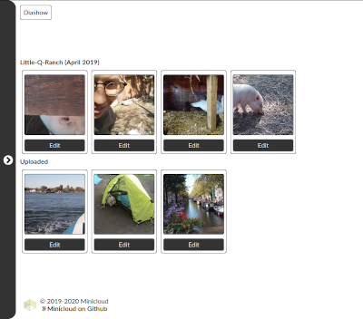

:warning: **This version is not fully tested**

## Requirements

    sudo apt install git \
                     libpq-dev \
                     python3-dev \
                     python3-venv \
                     python3-pip

## Release numbering plan

A release numbers consist of three parts, a major number, a minor number, and a
revision number, each separated by a dot.

* Major number:
  A change in the major release number indicates a huge system change. Don't
  consider an easy migration with a lower system number.

* Minor number:
  A change in the minor release number indicates new system features, UI/UX changes or a
  change in the database schema. Consider reading the [migration log](share/Migration.md).

* Revision number:
  A change in the revision number indicates bug fixes and package
  updates. It is always recommended updating to the latest revision number.

The current release number can be printed out:

    source bin/activate
    python admtool.py minicloud --version

## Quick Start

The simplest way to start is building a docker container and accessing it
directly or using a reverse proxy like nginx. Otherwise you have to build the
complete environment by yourself.

    sudo groupadd -g 9001 minicloud
    useradd -u 9001 -g 9001 -d /home/minicloud -m -s /bin/bash minicloud
    sudo -u postgres createuser -P -d minicloud
    sudo -u postgres createdb -T template0 -l 'en_US.UTF-8' -E 'UTF-8' -O minicloud minicloud

    su - minicloud
    cd ~

    git clone https://github.com/manuel-io/minicloud.git /home/minicloud
    python3 -m venv /home/minicloud

    psql < /home/minicloud/share/schema.sql

    cp /home/minicloud/share/minicloud.service /etc/systemd/system/minicloud.service
    cp /home/minicloud/share/minicloud.nginx /etc/nginx/sites-available/minicloud

...

    systemctl restart postgresql.service
    systemctl restart nginx.service
    systemctl restart rsyslog.service
    systemctl restart minicloud.service
    systemctl restart minidlna.service

## Dockerfile

    git clone https://github.com/manuel-io/minicloud.git minicloud .
    docker build -t minicloud .
    docker run --network host -d -P --name cloud minicloud

#### Inspect the container

The default password for the user minicloud is minicloud.

    ssh minicloud@localhost

#### Copy a file to the container

    scp ~/movies/butenland-2020.mp4 minicloud@localhost:/var/minicloud/multimedia/documentaries

## Environment variables

#### Database settings (optional)

    export MINICLOUD_HOST="127.0.0.1"
    export MINICLOUD_DBNAME="minicloud"
    export MINICLOUD_USR="minicloud"
    export MINICLOUD_PWD="minicloud"

#### DLNA settings (optional)

    export MINICLOUD_DLNA="http://127.0.0.1:8200"
    export MINICLOUD_DLNA_NOVERIFY="True"
    export MINICLOUD_DLNA_PROXY_HOST="https://dlna.example.com"
    export MINICLOUD_DLNA_PROXY_PORT="8290"

## SimpleLightbox

SimpleLightbox (https://github.com/andreknieriem/simplelightbox) is licensed
under the MIT License (MIT)

## Font Awesome

Graphic files under static/fontawsame are a product of the Font Awesome
library (https://fontawesome.com/) and distributed under the Creative Commons
Attribution BY 4.0 International license (https://fontawesome.com/license/free)

## Lato Font

The main font in the default
design is from the Lato font
family and licensed under SIL Open Font License 1.1
(https://scripts.sil.org/cms/scripts/page.php?site_id=nrsi&id=OFL)
